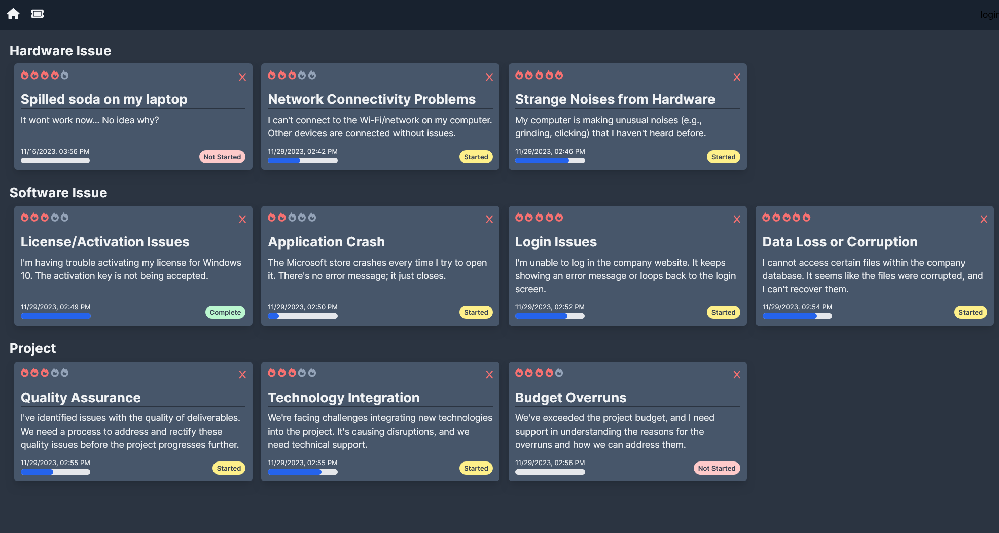
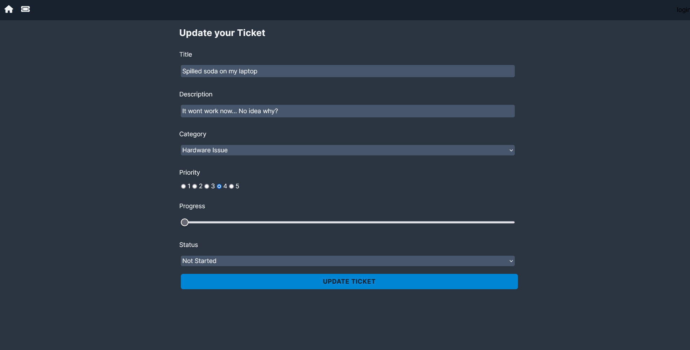
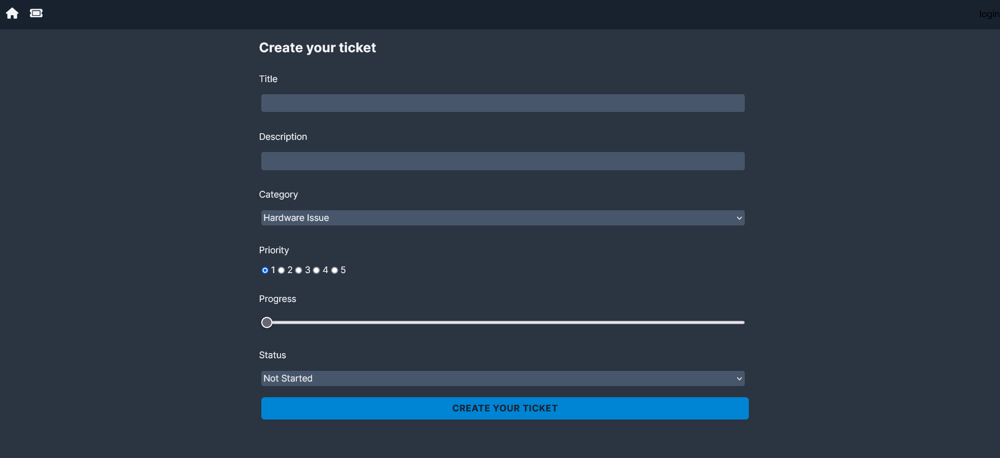
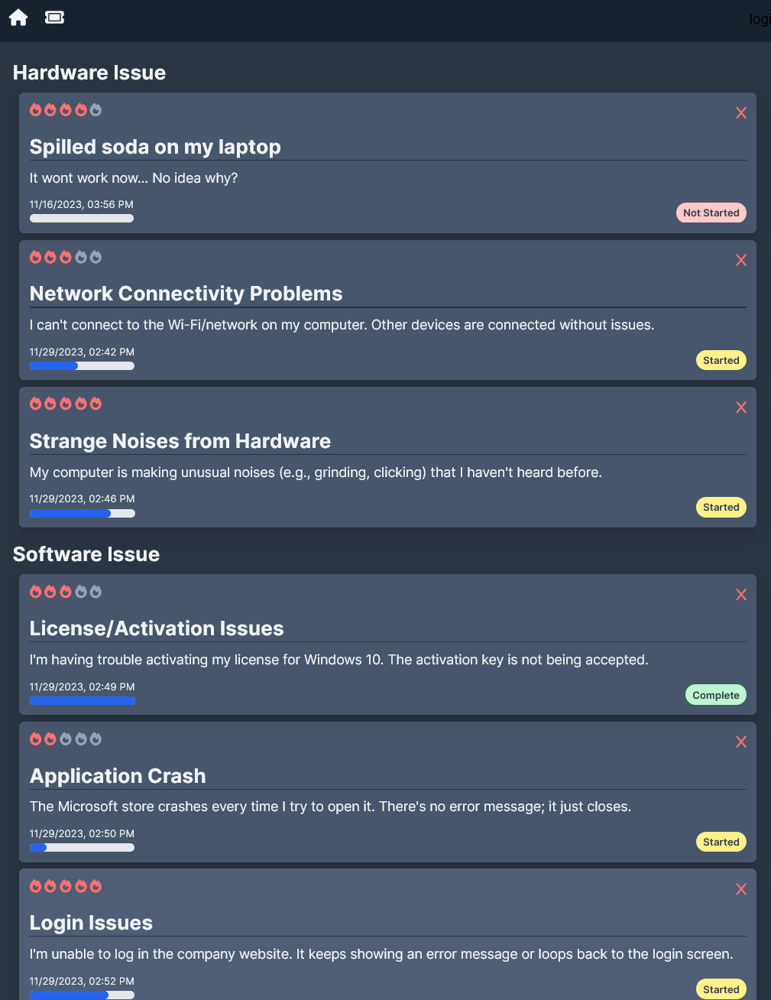
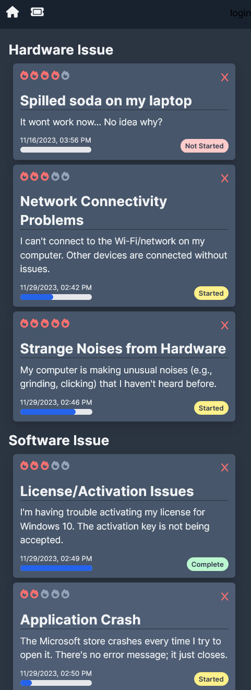

# Ticket Master

## Getting started

Cosmos was created using Django for the backend and react for the front end. This application is fully containerized using Docker. To run the application please utilize our docker compose file. While in your terminal navigate to this project and in the parent directory please run the command "docker compose build" followed by "docker compose up". 

## Application Details

Ticket Master is a React and Next.js-powered ticketing app with MongoDB integration, simplifies issue management for teams. Its intuitive interface, and customizable workflows empower teams to resolve issues efficiently.

Leveraging the use of MongoDB, Ticket Master stores and retrieves data efficiently, ensuring high performance and reliability. Benefit from the flexibility of a NoSQL database to adapt to changing requirements.

Users can easily create new tickets, providing detailed information about the issues they encounter. This application supports , reading, creating, updating, and deleteing tickets that were created.

This application was created so I could gain a better understanding of Next.js and mongoDB. I made sure to take full advantages of all the features that next has to offer including its new app router and so many other features. 

I've also made the entire application fully responsive on all screen sizes. Using tailwind allowed me to do this with little to no difficulty. Please see the examples below to get a better idea of how the application is working and how it looks on different size screens.
***

# CRUD

<h3> The home page allows users to see all the tickets created and the information contained in those tickets. Information such as the priority level, the title, the description, the progress and the date/time the ticket was created. </h3>

<h3> Users can click on a ticket to view the unique ticket in detail, they can also edit information about the ticket. </h3>

<h3> Clicking the ticket icon on top left will bring users to a new page that allows them to create a ticket. </h3>

<h3> This application is fully responsive on all screen sizes. Utilizing tailwind helped in this process. Here you can see the application on medium and small devices. </h3>

## Technologies 
HTML, CSS, JS, React, Next.js, Tailwind, MongoDB
